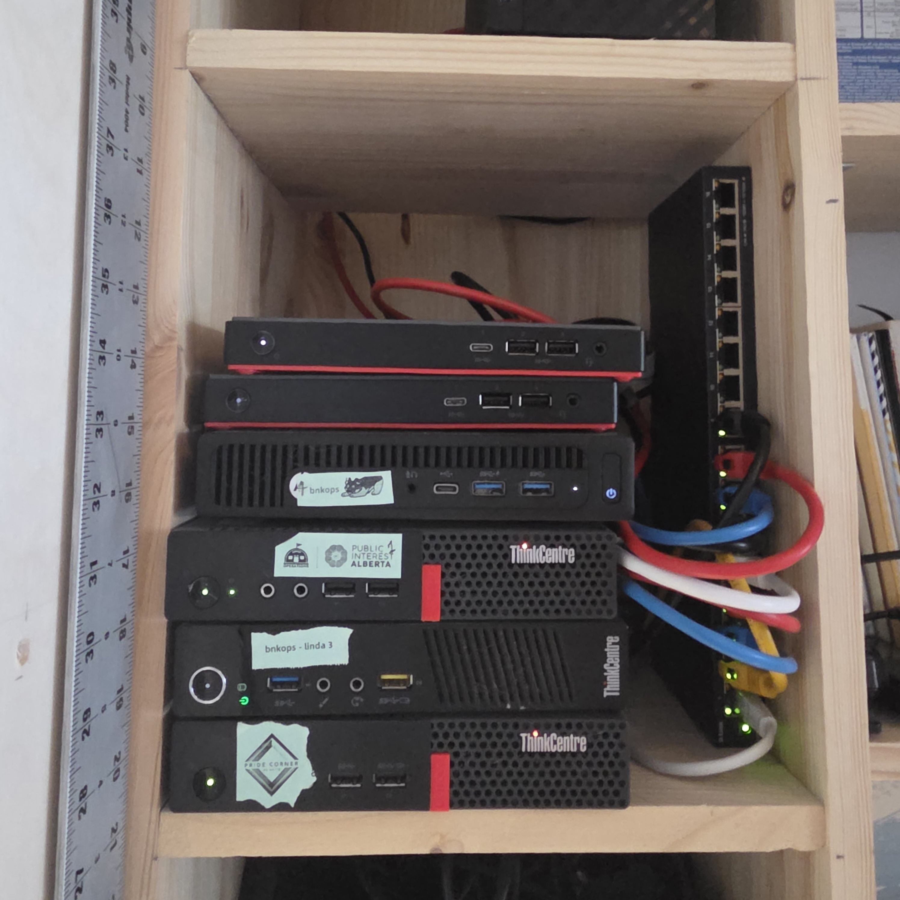

A campaign in a box

<h1 class="hero-h1">Your <em>org</em>, your stack, your <em>data</em>.</h1>

A campaign for <strong>[issue]</strong>. Built and run by <strong>[people]</strong>. Find us, join us, support the work.

[Subscribe →](subscribe.md){ .cta-primary }
[Slides](slides.md){ .cta-secondary }
[Writing](writing.md){ .cta-secondary }
[Resources](resources.md){ .cta-secondary }

n3-pia · the actual hardware
★ ★ ★

$0
License fees

7
Services, one compose file

~$10
Per month, SMTP relay

$149
For the actual server

## Why this stack

A thousand neighbourhood lists will out-organize any single national list.
— The thesis

This site, plus a newsletter system, plus a live writing pad — runs entirely on free, open-source software your org controls. Nothing rented from Substack, Squarespace, or Mailchimp. The whole thing is one `docker-compose.yml` file you can fork, modify, and host anywhere.

If you're seeing this page, your starter stack is working. **Now make it yours.**

## What's running

replaces · <b>Squarespace</b>
### [MkDocs Material](https://squidfunk.github.io/mkdocs-material/)
The site you're reading. Markdown in, static site out.

replaces · <b>Mailchimp</b>
### [Listmonk](https://listmonk.app/)
Email lists and campaigns. No per-contact billing, your sending reputation.

replaces · <b>Google Docs</b>
### [CryptPad](https://cryptpad.org/)
End-to-end encrypted collaborative pads. No Google account.

replaces · <b>Cloudflare Tunnel</b>
### [Pangolin / Newt](https://docs.fossorial.io/)
Outbound tunnel to a public TLS endpoint. No exposed ports.

replaces · <b>Stack Overflow Teams</b>
### [Apache Answer](https://answer.apache.org/)
Member Q&A and a public help centre that grows over time.

replaces · <b>SSH + vim</b>
### [Code Server](https://github.com/coder/code-server)
Browser-based VS Code for editing the site from any device.

replaces · <b>a half-built `index.html`</b>
### [Homepage](https://gethomepage.dev/)
Service dashboard at `lander.<your-domain>`. One door for staff and members.

replaces · <b>nothing</b>
### [The repo itself](https://github.com/adminatthebunker/PIA-BNKOP-SERVER)
Every config, every secret-template, every diagram. Forkable.

## How to edit this site

01

<strong>In a text editor on your laptop.</strong> Open a markdown file under <code>docs/</code>, edit, save. The container rebuilds automatically.

02

<strong>Through Git.</strong> Clone the repo, edit, commit, push. Pull on the server — the site rebuilds.

03

<strong>Hand it off to a generalist.</strong> Markdown is plain text. Anyone on your team can write it.

[Read the install guide →](install.md){ .cta-primary }

## Where to next

[**Research**](research.md) — what we've found, what we're learning.

[**Writing**](writing.md) — short pieces from the room.

[**Resources**](resources.md) — the tools and patterns we recommend.

[**Subscribe**](subscribe.md) — get our updates by email.

// stack: mkdocs · listmonk · cryptpad · pangolin · code-server · homepage
co-designed at PIA 2026 · maintained by [The Bunker Operations](https://bnkops.com)

